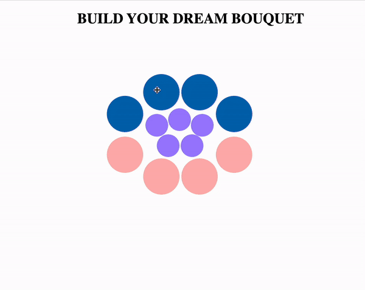

# flowerApp
Project created with Fabric.js,using HTML, SCSS and JavaScript. 
I have learned new things during this project as before was not familiar with Fabric.js.
This App is responsive and looks good on different screen sizes.

You can open this App in browser locally using *npm start dev* on command line what opens 
local server on http://localhost:3000/.

You can see how it works.

